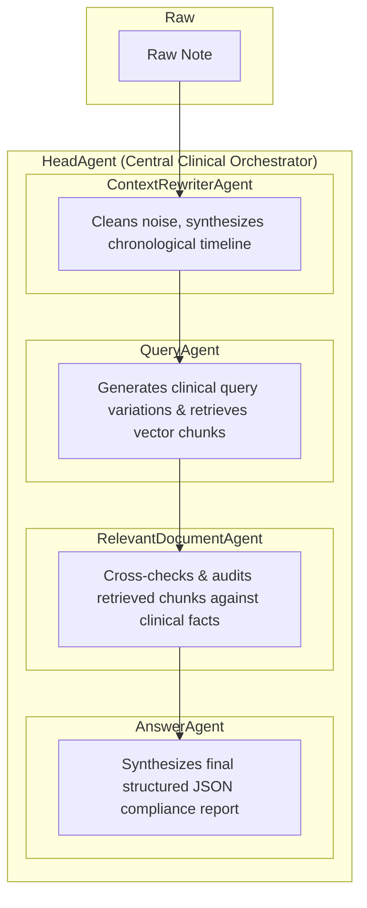

# Multi-Agent Clinical Revision System
[Live Demo](https://ahmc-sde-exercise-41axlbrhl-po-s-projects3.vercel.app/)
---

## 1. Architecture Overview

The system is built on a architecture using **FastAPI backend**, **React  frontend**, a remote **ChromaDB vector cluster**, and a **MongoDB Atlas** document store.

### Multi-Agent Orchestration Flow
The core of the application is a centralized coordinator (`HeadAgent`) that handles input notes and manages four specialized sub-agents sequentially to eliminate data leakage and maintain clinical compliance:

### Multi-Agent Orchestration Flow
The heart of the application is driven by a centralized coordinator (`HeadAgent`) that handles resource lifecycles and manages four specialized sub-agents sequentially to eliminate data leakage and maintain extreme clinical compliance:



---

## 2. Tech Stack Choices and Reason

| Component | Technology | Rationale |
| :--- | :--- | :--- |
| **Backend Framework** | FastAPI  | Native asynchronous support and integration with Pydantic for data validation. |
| **Frontend Framework**| React + Vite + TS | Lightning-fast HMR builds, strict compile-time type-safety for complex API JSON payloads, and reactive state management. |
| **Vector Database** | ChromaDB | Lightweight, high-performance semantic indexer supporting distance metrics and direct metadata filtering. Deployed via Railway. |
| **Primary Database** | MongoDB Atlas | Schemaless, scalable cloud document storage. |
| **LLM Core Engine** | OpenAI `gpt-4o` | Superior reasoning, unparalleled instruction-following capabilities for multi-agent roles, and deterministic structured JSON output. |
| **Embeddings** | `text-embedding-3-small`| Exceptional accuracy-to-cost ratio, natively outputs 1536-dimensional vectors for precise medical mapping. |

## 3. How You Structured the Clinical Note

The system uses a two-part strategy based on Pydantic schemas to convert text into clear data structures.

* **Initial Clinical Extraction Layer (`PatientSnapshotSchema`)**: The `ContextRewriterAgent` takes in the raw note and directly maps it into a complete clinical snapshot. This schema ensures strict type safety across several fields:
  * **Demographics & Context**: Formats standard features such as age, gender, and a brief chronological `history_of_present_illness`.
  * **Comorbidities & Interventions**: Maps arrays of strings for `past_medical_history`, `current_medications`, and active `key_clinical_findings`.
  * **Object Separation (`VitalsSchema` & `LabsSchema`)**: Breaks down vital signs into individual integer or float values (systolic/diastolic blood pressure, heart rate, respiratory rate, temperature, SpO2) and organizes clinical lab values into structured floats or key-value pairs for non-standard findings.

* **Final Report Synthesis Layer (`FinalAssessmentSchema`)**: Once evaluated by the core pipeline, the structured information is consolidated into a clinical artifact. This schema cleanly segments validated chief complaints, an operational `hpi_summary`, a strict `disposition_recommendation` literal ("Admit", "Observe", "Discharge", "Unknown"), and inherited gap tracking.

---

## 4. How You Generated the Revised HPI

The **Revised HPI** is created during the final stage of the pipeline by the `AnswerAgent` and stored in the `revised_hpi` string field of the `FinalAssessmentSchema`. 

Instead of doing a standard summary, this process uses a method that combines multiple contexts, driven by a specialized clinical prompt:

1. **Multi-Context Ingestion**: The agent receives the extracted structured patient snapshot, the validated compliance data from the audit report, and the actual raw text from the verified MCG clinical guidelines.
2. **Sentence-by-Sentence Evidence Cross-Examination**: The system prompt strictly prohibits passive descriptions. It requires a detailed cross-examination format where the patient's quantitative results are compared line-by-line against the retrieved MCG thresholds. For example, instead of saying *"the patient had metabolic acidosis,"* the agent writes, *"The patient presented with a severe metabolic acidosis as shown by an arterial pH of 7.20, which meets the retrieved MCG threshold of pH less than 7.30."*
3. **High-Risk Interaction Highlighting**: The agent is clearly instructed to identify hidden physiological patterns. It documents how complex drug-disease interactions, like an SGLT2 inhibitor such as Jardiance disguising a severe euglycemic DKA state with a near-normal serum glucose level, support a need for higher levels of inpatient care.

---

## 5. How You Handled Uncertainty or Missing Information

The platform incorporates strict uncertainty tracking and gap analysis into the agent communication payload.

* **Gaps Tracking (`DocumentRelevanceSchema`)**: For each candidate guideline evaluation chunk, there is a specific string list field called `missing_required_metrics`. This field captures specific measurements, such as an unrecorded anion gap value or missing arterial blood gas results. These measurements are required by the guideline for decision-making but are absent or unclear in the raw chart notes.
* **Active Physician Auditing Protocol**: The `RelevantDocumentAgent` serves as a quality guard. It follows a strict "Gaps Analysis" protocol. If a matched guideline points to an evaluation path that cannot be cross-referenced with a clear textual source in the patient profile, it marks that criterion as missing or unverified instead of making assumptions.
* **Systemic Propagation (`ClinicalAuditReportSchema`, `FinalAssessmentSchema`)**: The identified gaps are combined into a central narrative field called `uncertainties_or_missing_info`. This narrative is then sent downstream to the `AnswerAgent`, which carries the uncertainty and incorporates it into the final `FinalAssessmentSchema` report. This process ensures that clinical uncertainties are clearly highlighted for human reviewers instead of being ignored by the AI model.

## 6. How to Run the Project Locally

### Prerequisites
* Python 3.11+
* Node.js 20+
* An active OpenAI API Key

### Clone and Setup Environment
```bash
git clone [https://github.com/your-repo/AHMC-SDE-Exercise.git](https://github.com/your-repo/AHMC-SDE-Exercise.git)
cd AHMC-SDE-Exercise
```

### 1. Run the Vector Database Indexer
Before starting the backend, ingest the medical guidelines into the local or remote chromadb instance.
Configure your .env file at the root level:
```bash
OPENAI_API_KEY=sk-proj-xxxxxx
EMBEDDING_MODEL_NAME=text-embedding-3-small

# ChromaDB Version Control Matrix (Cloud Target)
# CHROMA_MODE=http
# CHROMA_HOST=XXXX
# CHROMA_PORT=443
# CHROMA_SSL=True

# ChromaDB Version Control Matrix (Local Target)
CHROMA_MODE=persistent
CHROMA_HOST=localhost
CHROMA_PORT=8000
CHROMA_SSL=False

# # Vector Database Settings
CHROMA_DB_PATH=./vector_db
CHROMA_COLLECTION_NAME=medical_guidelines

MONGODB_URI=mongodb://localhost:27017
MONGODB_DB_NAME=utilization_review_db
```
Run the vector indexer script:
```bash
python scripts/vector_indexer.py
```

### 2. MongoDB setup
If you have Docker Desktop installed, Open your terminal (or PowerShell) and execute the following command to launch a MongoDB container listening on the default port:
```bash
docker run -d --name local-mongo -p 27017:27017 mongo:latest
```

### 3. Run the Backend API
Navigate to the decoupled `backend` directory:
```bash
cd backend
python -m venv venv
source venv/bin/activate  # On Windows: venv\Scripts\activate
pip install -r requirements.txt

# Start the development server
uvicorn src.app:app --reload --port 8000
```


### 4. Run the Frontend App
Open a new terminal session and navigate to the frontend directory:
```bash
cd frontend
npm install
npm run dev
```
Open http://localhost:5173 in the browser.


## 7. AI-Assisted Development Disclosure
Which AI-Assisted Tools Were Used: Gemini-Flash Extend

| Module | Implementation | Details |
| :--- | :--- | :--- |
| **HTML Cleaning & Preprocessing** | 20% Manual / 80% AI | I gave AI the instruction to analyze the relastion between M-130_Diabetes.links.json and M-130_Diabetes.relation.json and M-130_Diabetes.raw.html. AI generate the parsing code to do the preprocess and text clean. |
| **Multi-Agent Orchestration & Refactoring** | 70% Manual / 30% AI | I wrote the structural logic for state passing, dependency injection, and client initialization within all agents. AI helps to debug and generate better coding style and test script. AI also gives the first version for each agent, I later add more information and more clear wording and how to use the schema properly.|
| **Backend Development** | 80% Manual / 20% AI | Besides agent construction, I use FastAPI to build the backend service including routes, services and deploy `Dockerfile`. AI handles the DB connection part for me. |
| **Frontend Development** | 40% Manual / 60% AI | I gave AI how I image the web would look like and what functions should each component include. AI generated the css and the html component. I mainly focused on the service layer and the component functions  |


## 8. Future Improvements
LLM-as-a-Judge Automation: Build a systematic, quantitative evaluation matrix using an independent evaluator agent to compute precision/recall metrics for retrieved guidelines against an anonymized clinical evaluation dataset.